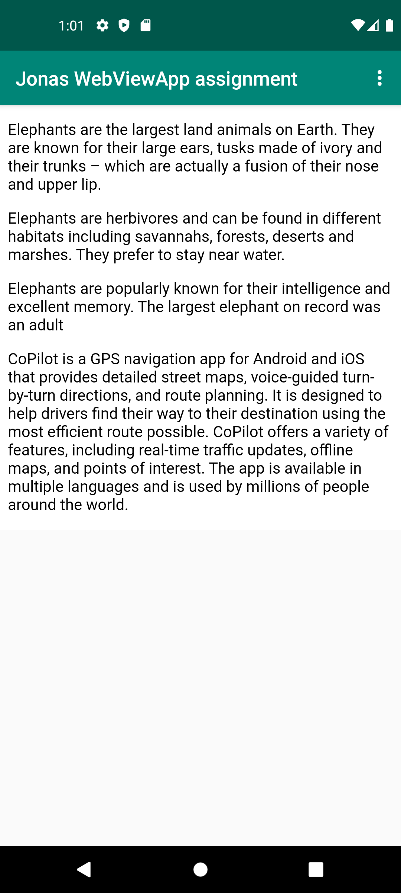
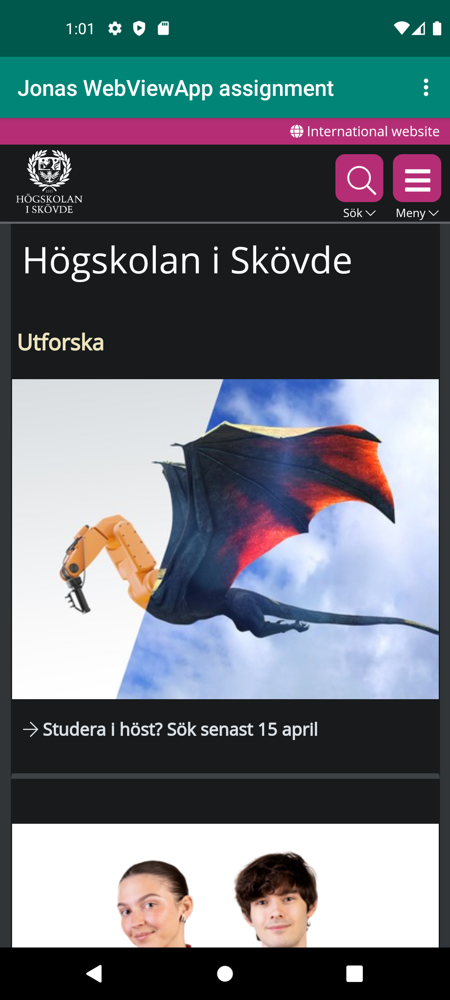

# Rapport

jag började mned att ge internet access til appen genom att lägga till följande i manifest filen
``` xml
    <uses-permission android:name="android.permission.INTERNET" />
    <uses-permission android:name="android.permission.ACCESS_NETWORK_STATE" />
```
därefter skapade jag en WebView, constrainade den till toolbaren och resten av skärmen och gav den ett id
``` xml
<WebView
    android:id="@+id/webView"

    android:layout_width="match_parent"
    android:layout_height="wrap_content"

    app:layout_constraintTop_toBottomOf="@+id/appBarLayout" 
/>
```

Jag skapade en webview och en webclient och instantsierade dessa i onCreate()
``` java
protected void onCreate(Bundle savedInstanceState) {
    myWebView = findViewById(R.id.webView);
    myWebViewClient = new WebViewClient();
    myWebView.setWebViewClient(myWebViewClient);
    myWebView.getSettings().setJavaScriptEnabled(true);
}
```
jag skapade en intern HTML fil och lät coPilot generera saker i den


Jag gjorde så att toolbarens knappar ladde in olika sider beroende vilken som blev klickad
``` java
if (id == R.id.action_external_web) {
            Log.d("==>","Will display external web page");
            myWebView.loadUrl("https://www.his.se");
            return true;
        }

        if (id == R.id.action_internal_web) {
            Log.d("==>","Will display internal web page");
            myWebView.loadUrl("file:///android_asset/myHTML.html");
            return true;
        }
```
